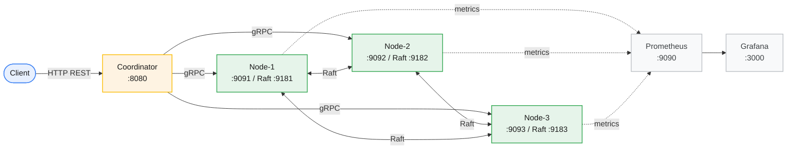
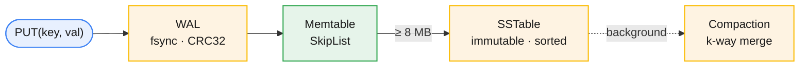
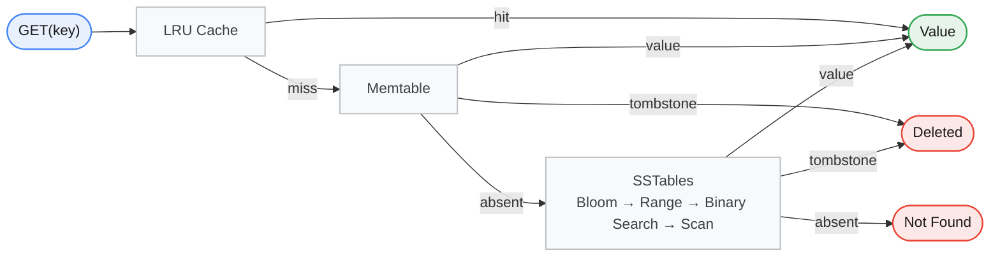
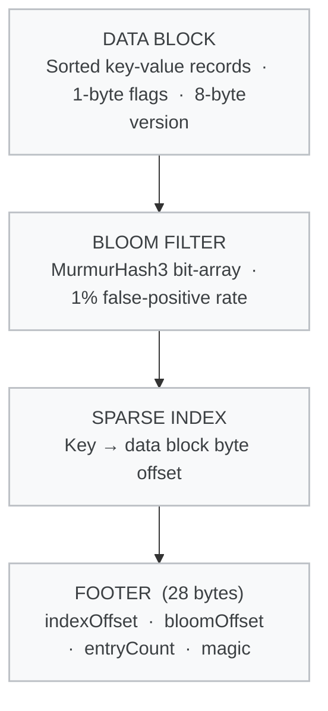
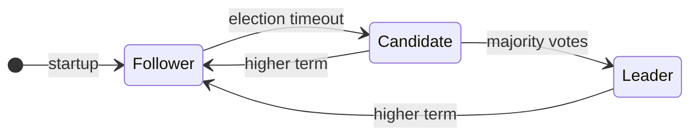
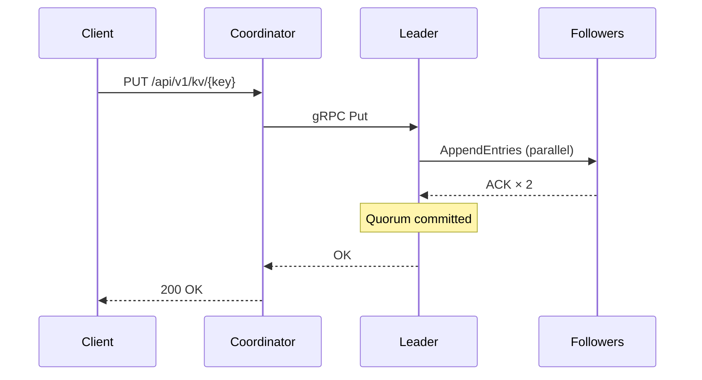

# Distributed NoSQL Key-Value Database

[](https://openjdk.org/projects/jdk/21/)
[](https://spring.io/projects/spring-boot)
[](https://grpc.io)
[](https://raft.github.io)
[](https://docs.docker.com/compose/)
[](https://vitejs.dev)
[](LICENSE)

> A distributed key-value store built entirely from scratch in Java — modeled after the internals of **RocksDB**, **Cassandra**, **DynamoDB**, and **etcd**. Every subsystem is hand-rolled: the LSM-tree storage engine, consistent-hash router, Raft consensus state machine, and a real-time React dashboard.

---

## Table of Contents

- [Overview](#overview)
- [Architecture](#architecture)
- [Storage Engine](#storage-engine)
- [Cluster & Routing](#cluster--routing)
- [Raft Consensus](#raft-consensus)
- [Observability](#observability)
- [Quick Start](#quick-start)
- [API Reference](#api-reference)
- [Configuration](#configuration)
- [Design Decisions](#design-decisions)
- [Project Structure](#project-structure)

---

## Overview

| Layer | Technology | Inspired by |
|---|---|---|
| Storage | LSM-Tree — WAL, Memtable, SSTables, Compaction | RocksDB, LevelDB |
| Read optimizations | Bloom Filter + Sparse Index + LRU Cache | BigTable, RocksDB |
| Durability | WAL with CRC32 + crash-safe replay | PostgreSQL WAL |
| Routing | Consistent Hashing — MD5, 150 VNodes/node | DynamoDB, Cassandra |
| Transport | gRPC + Protocol Buffers on dual ports | Cassandra internals |
| Consensus | Custom Raft — election + quorum writes + persistent state | etcd, CockroachDB |
| Observability | Prometheus + Grafana + SSE event stream | Datadog |
| Frontend | React/Vite real-time dashboard with hash ring | — |

**Consistency:** CP — all writes go through the Raft leader and require a majority quorum (≥ 2/3 nodes). The cluster refuses writes during quorum loss.

---

## Architecture



---

## Storage Engine

### Write Path



> Every write first hits the WAL for durability, then updates the in-memory Memtable. When the Memtable reaches its size threshold it is flushed as an immutable SSTable. Background compaction merges SSTables to bound read amplification.

### Read Path



### SSTable File Layout



---

## Cluster & Routing

The coordinator routes every key using a **consistent-hash ring** with 150 virtual nodes per physical node — the same algorithm as DynamoDB and Cassandra. The ring is backed by a `ConcurrentSkipListMap<BigInteger, NodeInfo>` for lock-free O(log N) key lookups.

All **writes** are sent directly to the current Raft leader. If a node replies `NOT_LEADER:<id>`, the coordinator updates its leader cache and retries. **Reads** are routed via consistent hash to any live node.

---

## Raft Consensus

Each storage node runs a complete Raft state machine (`RaftNode`). The implementation is **transport-agnostic** — `GrpcRaftTransport` handles the wire; the state machine only knows about `handleRequestVote` and `handleAppendEntries`. This makes it fully unit-testable in isolation.

### Role Transitions



### Write Flow



### Feature Coverage

| Feature | Status |
|---|---|
| Leader election — randomised timeout 150–300 ms | ✅ |
| Heartbeat — empty AppendEntries every 50 ms | ✅ |
| RequestVote — term + log-up-to-date check | ✅ |
| AppendEntries — consistency check + commit | ✅ |
| Majority quorum write (N/2 + 1) | ✅ |
| Follower rejects with `NOT_LEADER:<id>` | ✅ |
| Persistent state — `term` + `votedFor` on disk | ✅ |
| Spring `SmartLifecycle` integration | ✅ |

---

## Observability

The React dashboard (`/ui`) subscribes to the coordinator's SSE stream and updates in real-time without polling.

| Panel | Description |
|---|---|
| Stats Bar | Cluster-wide counts, p99 latency, live event rate |
| Hash Ring | SVG of the MD5 ring with all 450 virtual node positions |
| Node Cards | Memtable fill %, WAL size, SSTable count, LRU hit rate, Raft role |
| Terminal Log | Live event stream — PUT/GET/DELETE, SSTable flushes, status changes |
| Storage Visualizer | Deep view of SSTable files and memtable contents per node |
| Burst Test | Fire N concurrent writes and observe key distribution |
| Write Path | Animated WAL → Memtable → SSTable flow |
| Interactive Store | Manual PUT/GET/DELETE from the UI |

Custom Prometheus metrics exported per node: `kv.raft.term`, `kv.raft.commit.index`, `kv.raft.is.leader`, `kv.memtable.fill.percent`, `kv.wal.bytes`, `kv.sstable.count`. Grafana dashboards are auto-provisioned on first startup.

---

## Quick Start

### Prerequisites

| Tool | Version | Install |
|---|---|---|
| Java JDK | 21+ | `brew install openjdk@21` |
| Docker Desktop | Latest | [docker.com](https://docker.com) |
| Node.js | 18+ | `brew install node` |
| grpcurl (optional) | Latest | `brew install grpcurl` |

### Docker Compose (recommended)

```bash
git clone https://github.com/shubhxtech/Distributed-NoSQL-Key-Value-Database.git
cd Distributed-NoSQL-Key-Value-Database

docker compose up --build -d

# verify after ~30s
curl http://localhost:8080/api/v1/monitor/state
```

| Service | URL |
|---|---|
| Coordinator REST | http://localhost:8080 |
| Node actuators | :8081 · :8082 · :8083 |
| Prometheus | http://localhost:9090 |
| Grafana | http://localhost:3000 (admin / admin) |

```bash
# Start dashboard UI separately
cd ui && npm install && npm run dev
# http://localhost:5173
```

### Local (no Docker)

```bash
./gradlew build -x test

# run each in a separate terminal
NODE_ID=node-1 GRPC_PORT=9091 HTTP_PORT=8081 RAFT_PORT=9181 \
  RAFT_PEERS="node-2=localhost:9182,node-3=localhost:9183" ./gradlew :node:bootRun

NODE_ID=node-2 GRPC_PORT=9092 HTTP_PORT=8082 RAFT_PORT=9182 \
  RAFT_PEERS="node-1=localhost:9181,node-3=localhost:9183" ./gradlew :node:bootRun

NODE_ID=node-3 GRPC_PORT=9093 HTTP_PORT=8083 RAFT_PORT=9183 \
  RAFT_PEERS="node-1=localhost:9181,node-2=localhost:9182" ./gradlew :node:bootRun

./gradlew :coordinator:bootRun
cd ui && npm install && npm run dev
```

```bash
# tests
./gradlew test
./gradlew :raft:test   # Raft unit tests only
```

---

## API Reference

```bash
# PUT
curl -X PUT http://localhost:8080/api/v1/kv/user:1 \
  -H 'Content-Type: application/json' -d '{"value":"Shubh Sahu"}'

# GET
curl http://localhost:8080/api/v1/kv/user:1

# DELETE
curl -X DELETE http://localhost:8080/api/v1/kv/user:1

# Monitoring
curl http://localhost:8080/api/v1/monitor/state        # cluster snapshot
curl http://localhost:8080/api/v1/monitor/ring         # hash ring
curl -N http://localhost:8080/api/v1/monitor/events    # SSE stream

# Per-node
curl http://localhost:8081/api/v1/storage/state        # role, memtable %, SSTables
curl http://localhost:8081/api/v1/storage/debug/dump   # deep dump
curl -X POST http://localhost:8081/api/v1/storage/compact

# Fault injection
curl -X POST http://localhost:8080/api/v1/monitor/nodes/node-2/kill     # isolate
curl -X POST http://localhost:8080/api/v1/monitor/nodes/node-2/restart  # reconnect

# Direct gRPC
grpcurl -plaintext -d '{"sender_id":"cli"}' localhost:9091 kvstore.v1.KvService/Ping
grpcurl -plaintext \
  -d '{"key":"hello","value":"'$(echo -n 'world'|base64)'"}' \
  localhost:9091 kvstore.v1.KvService/Put
```

> The `kill` endpoint is a coordinator-level routing block, not a process kill. Raft continues normally. Use `docker stop kv-node-2` to simulate a true crash.

---

## Configuration

| Variable | Default | Description |
|---|---|---|
| `NODE_ID` | `node-1` | Unique identifier |
| `HTTP_PORT` | `8081` | Actuator + storage API |
| `GRPC_PORT` | `9091` | Client KvService |
| `RAFT_PORT` | `9181` | Raft consensus (dedicated) |
| `RAFT_PEERS` | — | `"node-2=host:9182,node-3=host:9183"` |
| `DATA_DIR` | `./data/node-1` | WAL, SSTables, `raft.state` |
| `MEMTABLE_MAX_MB` | `8` | Flush threshold |

---

## Design Decisions

| Decision | Choice | Rationale |
|---|---|---|
| Memtable | `ConcurrentSkipListMap` | Sorted for SSTable flush; lock-free reads via CAS |
| WAL checksums | CRC32 per record | Detects torn writes; replay stops at first corrupt record |
| SSTable format | Custom binary | Full layout control; mirrors LevelDB; no external dep |
| Sparse index | Every Nth key → offset | Low memory; binary search + short linear scan |
| Compaction | Size-tiered | Write-heavy; fewer larger files |
| Hash ring | MD5 128-bit | Uniform distribution; fast; non-security use |
| Virtual nodes | 150 per node | <5% load deviation for 3-node cluster |
| Raft | Transport-agnostic state machine | State machine unit-testable without a network |
| Raft port | Dedicated gRPC port | Client traffic cannot starve consensus heartbeats |
| Raft applier | `Consumer<RaftLogEntry>` | Decouples Raft from storage engine |
| Persistent state | `raft.state` on disk | Prevents term regression and double-voting after crash |
| Spring lifecycle | `SmartLifecycle` | Raft starts after gRPC is ready; shuts down cleanly |
| Metrics | Micrometer → Prometheus | Zero-code instrumentation; industry standard |
| Dashboard transport | SSE (not WebSocket) | One-directional push; browser-native; no library needed |

**Consistency model:** CP — strong consistency for writes (Raft quorum), cluster refuses writes without quorum.

---

## Project Structure

```
Distributed-NoSQL-Key-Value-Database/
├── proto/                          # kv.proto · raft.proto
├── storage-engine/
│   └── engine/
│       ├── wal/                    # WalWriter (CRC32) · WalReader (crash replay)
│       ├── lsm/                    # SkipListMemtable
│       ├── sstable/                # SSTableWriter · SSTableReader · SSTableMetadata
│       ├── bloomfilter/            # BloomFilter (MurmurHash3)
│       ├── cache/                  # LruCache
│       ├── compaction/             # CompactionManager (k-way merge)
│       └── ttl/                    # TtlReaper
├── raft/
│   └── raft/
│       ├── RaftNode.java           # State machine — election, replication, commit
│       ├── RaftLog.java            # Thread-safe append-only log
│       ├── GrpcRaftTransport.java  # gRPC implementation
│       └── RaftServiceGrpcImpl.java
├── node/
│   └── node/
│       ├── NodeApplication.java    # Spring beans + gRPC server lifecycle
│       ├── grpc/KvServiceGrpcImpl.java   # PUT/GET/DELETE · leader enforcement
│       ├── metrics/StorageMetrics.java   # Raft gauges
│       └── monitoring/StorageStateController.java
├── coordinator/
│   └── coordinator/
│       ├── api/KvRestController.java     # Leader-aware write routing
│       ├── routing/ConsistentHashRouter.java
│       ├── client/NodeGrpcClient.java
│       └── monitoring/                   # SSE stream · isolate/reconnect
├── ui/src/
│   ├── components/                 # Dashboard · NodeCard · HashRing · TerminalLog
│   │                               # StorageVisualizer · BurstTest · WritePath
│   └── hooks/useClusterStream.ts   # SSE + node state reducer
├── config/
│   ├── prometheus.yml
│   └── grafana/provisioning/dashboards/kv-dashboard.json
├── docker-compose.yml
├── Dockerfile.node
└── Dockerfile.coordinator
```

---

## License

MIT — see [LICENSE](LICENSE).

---

*Built to understand distributed systems from the ground up, not just use them.*
