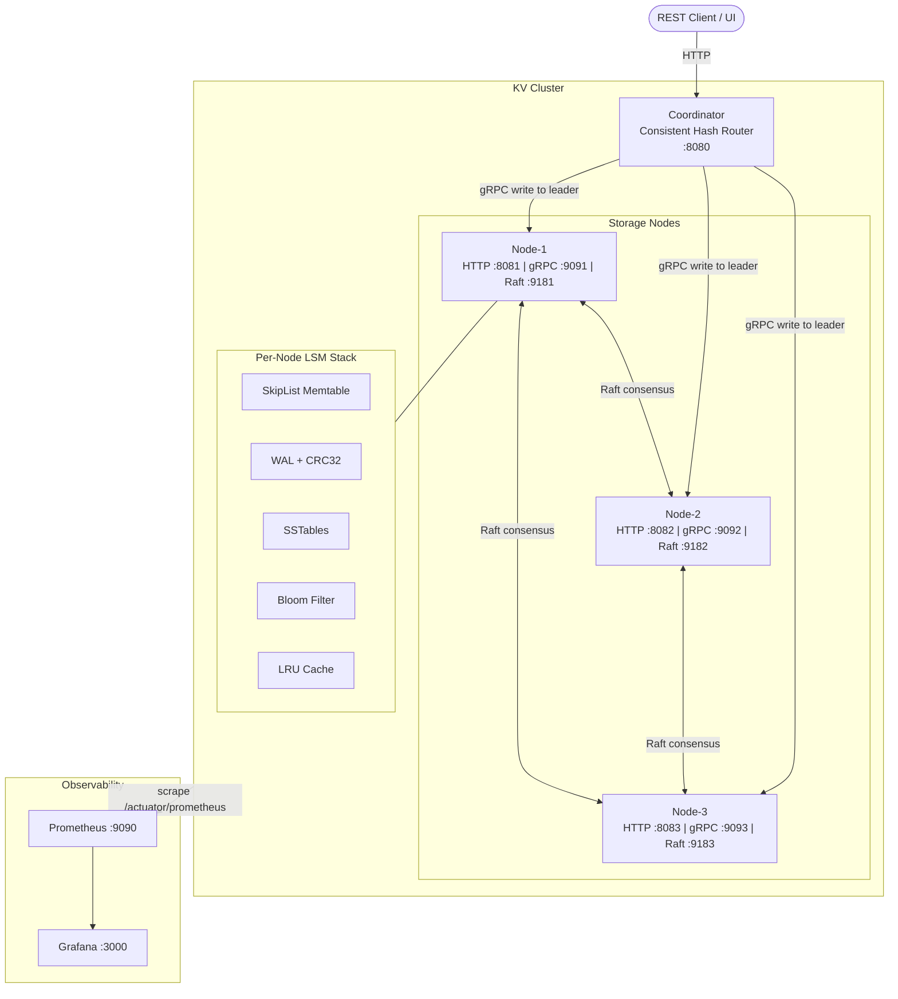
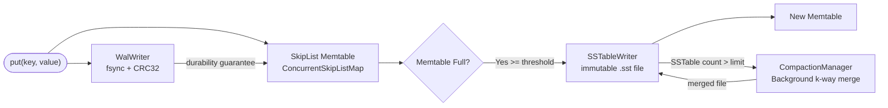
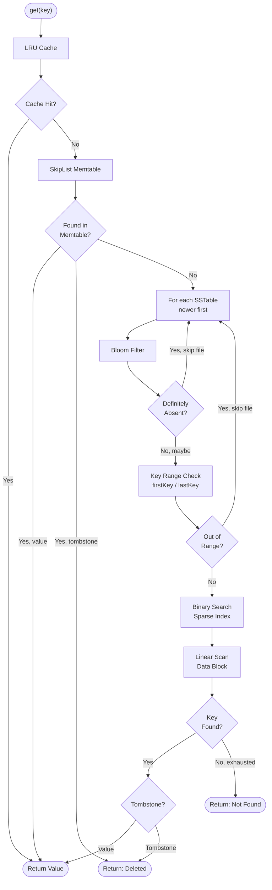
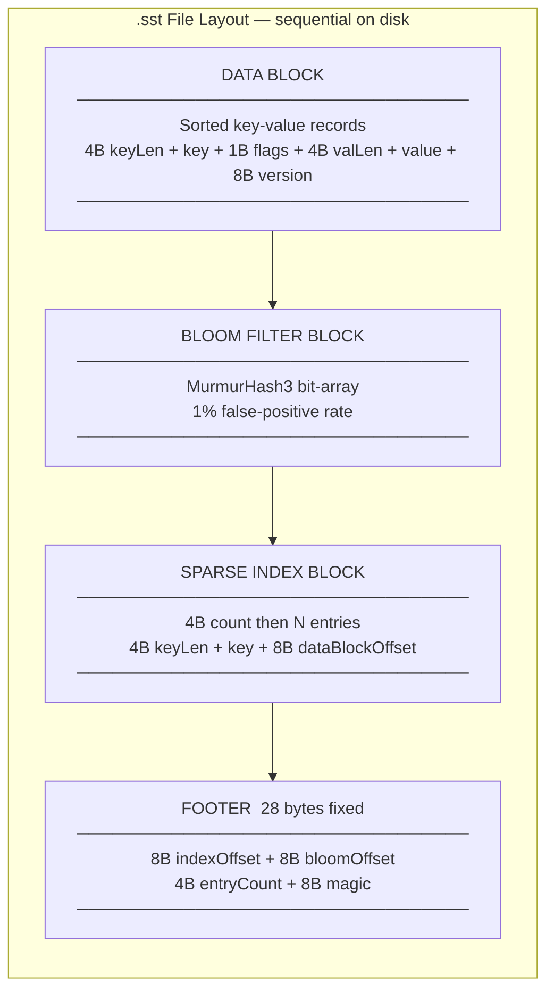
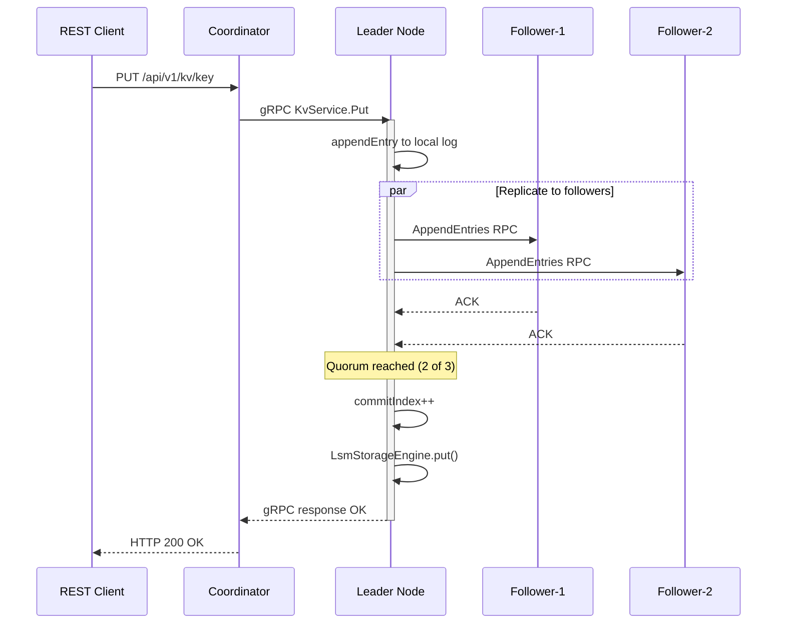
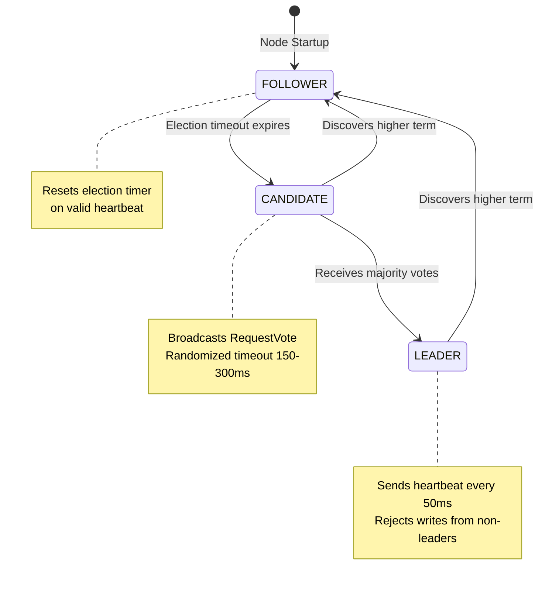

# Distributed NoSQL Key-Value Database

[](https://openjdk.org/projects/jdk/21/)
[](https://spring.io/projects/spring-boot)
[](https://grpc.io)
[](https://raft.github.io)
[](https://docs.docker.com/compose/)
[](https://vitejs.dev)
[](LICENSE)

> A distributed key-value store built entirely from scratch in Java — modeled after the internals of **RocksDB**, **Cassandra**, **DynamoDB**, and **etcd**. Every subsystem is hand-rolled: the LSM-tree storage engine, consistent-hash router, Raft consensus state machine, observability pipeline, and a real-time React dashboard.

---

## Table of Contents

- [Overview](#overview)
- [Architecture](#architecture)
- [Modules](#modules)
- [Storage Engine (LSM-Tree)](#storage-engine-lsm-tree)
- [Cluster & Routing](#cluster--routing)
- [Raft Consensus](#raft-consensus)
- [Observability](#observability)
- [Quick Start](#quick-start)
- [API Reference](#api-reference)
- [Configuration](#configuration)
- [Design Decisions](#design-decisions)
- [Project Structure](#project-structure)

---

## Overview

This project is a ground-up implementation of a distributed, replicated key-value database. The goal is to understand how production databases work at the systems level — not by using them, but by building each piece from first principles.

**What is implemented:**

| Layer | Technology | Inspired by |
|---|---|---|
| **Storage** | LSM-Tree with WAL, SkipList Memtable, SSTables, Size-tiered Compaction | RocksDB, Cassandra, LevelDB |
| **Read optimizations** | Bloom Filter (MurmurHash3) + Sparse Index + LRU Cache | RocksDB, BigTable |
| **Durability** | WAL with CRC32 checksums + crash-safe replay | PostgreSQL WAL, LevelDB |
| **Routing** | Consistent Hashing (MD5, 150 VNodes/node) | DynamoDB, Cassandra |
| **Transport** | gRPC + Protocol Buffers on dual ports | Cassandra internal wire protocol |
| **Consensus** | Custom Raft (leader election + quorum writes + persistent metadata) | etcd, CockroachDB |
| **Observability** | Prometheus + Grafana + SSE event stream | Datadog, CloudWatch |
| **Frontend** | React/Vite real-time cluster dashboard with hash ring visualizer | — |

**Consistency Guarantee:** CP (strongly consistent). All writes go through the Raft leader and require a majority quorum (>=2/3 nodes) to commit. The system refuses writes during quorum loss.

---

## Architecture



---

## Modules

| Module | Description |
|---|---|
| `proto/` | Protocol Buffer definitions for `KvService` (Put/Get/Delete/Ping) and `RaftService` (RequestVote/AppendEntries) |
| `storage-engine/` | Self-contained LSM-tree library: WAL, Memtable, SSTables, Compaction, Bloom Filter, LRU Cache, TTL |
| `node/` | Runnable storage node: Spring Boot + gRPC server + Raft lifecycle + Micrometer metrics |
| `coordinator/` | REST gateway: consistent-hash routing, leader-aware write routing, SSE event stream |
| `raft/` | Transport-agnostic Raft consensus state machine + gRPC transport layer |
| `ui/` | React/Vite real-time cluster dashboard |
| `config/` | Prometheus scrape config + Grafana dashboard provisioning |

---

## Storage Engine (LSM-Tree)

A complete Log-Structured Merge-Tree following the same fundamental design as RocksDB and LevelDB.

### Write Path



### Read Path



### SSTable File Format



> **Tombstones:** A DELETE writes a special record (`flags & 0x01 = 1`) rather than erasing the key. Older versions may exist in lower SSTables. Tombstones are purged during compaction once no older version remains.

### Compaction

Size-tiered compaction runs in a background thread when SSTable count exceeds the threshold. It performs a sorted k-way merge of N SSTables into one — eliminating duplicate keys (keeps highest version) and tombstones. This bounds read amplification and reclaims disk space.

### Crash Safety

On startup, `WalReader` replays the WAL from the last valid record. Each record has a CRC32 checksum. If a truncated or corrupt record is detected (power failure mid-write), replay stops cleanly at the last verified offset — no partial writes reach the Memtable.

---

## Cluster & Routing

### Consistent Hashing

The coordinator routes every key using a **consistent-hash ring** — the same algorithm as DynamoDB and Cassandra.

**Why not `hash(key) % N`?** Modulo hashing remaps every key when nodes join or leave. Consistent hashing bounds remapping to only the keys owned by the affected node.

**How it works:**
1. The 128-bit MD5 hash space is treated as a ring (0 → 2¹²⁸ − 1).
2. Each physical node gets **150 virtual node positions** (e.g. `node-1#0` … `node-1#149`).
3. A key is hashed with MD5 and routed to the **first node clockwise** from its position.
4. Ring is backed by `ConcurrentSkipListMap<BigInteger, NodeInfo>` — O(log N) ceiling lookups, thread-safe.

**Virtual nodes** prevent hot-spots: without VNodes, 3 physical nodes could give one node 60%+ of the keyspace. 150 VNodes ensures ≤5% deviation.

### Leader-Aware Write Routing

All writes (PUT, DELETE) are routed to the current Raft leader:
1. Coordinator caches the last known leader ID.
2. Sends the gRPC write directly to the cached leader.
3. If the node responds `NOT_LEADER:<newLeaderId>`, coordinator updates cache and retries.
4. Reads (GET) are routed via consistent hash to any live node.

---

## Raft Consensus

Each storage node runs a `RaftNode` — a complete implementation of the Raft consensus algorithm (Ongaro & Ousterhout, 2014). The state machine is **transport-agnostic**: `GrpcRaftTransport` handles actual network calls. This design makes the state machine fully unit-testable in isolation.

### What is implemented

| Feature | Status |
|---|---|
| Leader election with randomized timeout (150–300ms) | ✅ |
| Heartbeat (empty AppendEntries every 50ms) | ✅ |
| RequestVote RPC — term + log-up-to-date check | ✅ |
| AppendEntries RPC — log consistency check + commit | ✅ |
| Log replication on majority quorum (N/2 + 1) | ✅ |
| Raft → LSM bridge (committed entries applied to storage) | ✅ |
| gRPC transport on dedicated Raft port | ✅ |
| Spring Boot lifecycle integration (SmartLifecycle) | ✅ |
| Persistent state (term + votedFor flushed to `raft.state`) | ✅ |
| Follower rejects writes with `NOT_LEADER:<leaderId>` | ✅ |

### Raft Write Flow



### Raft Role State Machine



Dashboard indicator: 👑 **LEADER** — amber border | **CANDIDATE** — purple badge | **FOLLOWER** — default

### Persistent State Guarantees

`currentTerm` and `votedFor` are flushed to `raft.state` before every state transition. This prevents:
- **Term regression** — a rebooted node cannot decrement its term and issue stale votes.
- **Double voting** — a rebooted node cannot vote for two candidates in the same term.

---

## Observability

### Live React Dashboard (`localhost:5173`)

Connects to the coordinator's SSE stream and updates in real-time without polling.

| Panel | Description |
|---|---|
| **Stats Bar** | Cluster-wide operation counts, p99 latency, live event rate |
| **Hash Ring** | SVG visualization of the MD5 ring with all 450 virtual node positions |
| **Node Cards** | Live memtable fill %, WAL size, SSTable count, LRU cache hit rate, Raft role |
| **Terminal Log** | Streaming event log: operations, SSTable flushes, node status changes |
| **Storage Visualizer** | Deep view of SSTable files and live memtable contents per node |
| **Burst Test** | Fire N concurrent writes and observe key distribution |
| **Write Path** | Animated WAL → Memtable → SSTable flow diagram |
| **Interactive Store** | Manual PUT/GET/DELETE from the UI |

### Prometheus Metrics (`localhost:9090`)

| Metric | Description |
|---|---|
| `kv.raft.term` | Current Raft term |
| `kv.raft.commit.index` | Committed log index |
| `kv.raft.is.leader` | 1 if leader, 0 otherwise |
| `kv.memtable.fill.percent` | Memtable usage % |
| `kv.wal.bytes` | WAL file size in bytes |
| `kv.sstable.count` | Number of SSTable files on disk |
| `coordinator_puts_total` | Total PUT requests through coordinator |
| `coordinator_gets_total` | Total GET requests |
| `coordinator_errors_total` | Total coordinator errors |

Grafana dashboards are auto-provisioned on first startup at `localhost:3000` (admin/admin).

---

## Quick Start

### Prerequisites

| Tool | Version | Install |
|---|---|---|
| Java JDK | 21+ | `brew install openjdk@21` |
| Docker Desktop | Latest | [docker.com](https://docker.com) |
| Node.js | 18+ | `brew install node` |
| grpcurl (optional) | Latest | `brew install grpcurl` |

### Option A — Docker Compose (recommended)

```bash
git clone https://github.com/shubhxtech/Distributed-NoSQL-Key-Value-Database.git
cd Distributed-NoSQL-Key-Value-Database

# Build and start all services
docker compose up --build -d

# Wait ~30s for health checks, then verify
curl http://localhost:8080/api/v1/monitor/state
```

| Service | URL | Description |
|---|---|---|
| Coordinator REST API | http://localhost:8080 | PUT / GET / DELETE |
| Node-1 Actuator | http://localhost:8081/actuator | Health + metrics |
| Node-2 Actuator | http://localhost:8082/actuator | |
| Node-3 Actuator | http://localhost:8083/actuator | |
| Prometheus | http://localhost:9090 | Metric queries |
| Grafana | http://localhost:3000 | Dashboards (admin/admin) |

Then start the dashboard UI:

```bash
cd ui && npm install && npm run dev
# Dashboard: http://localhost:5173
```

### Option B — Run locally

```bash
./gradlew build -x test

# Terminal 1
NODE_ID=node-1 GRPC_PORT=9091 HTTP_PORT=8081 RAFT_PORT=9181 \
  RAFT_PEERS="node-2=localhost:9182,node-3=localhost:9183" \
  ./gradlew :node:bootRun

# Terminal 2
NODE_ID=node-2 GRPC_PORT=9092 HTTP_PORT=8082 RAFT_PORT=9182 \
  RAFT_PEERS="node-1=localhost:9181,node-3=localhost:9183" \
  ./gradlew :node:bootRun

# Terminal 3
NODE_ID=node-3 GRPC_PORT=9093 HTTP_PORT=8083 RAFT_PORT=9183 \
  RAFT_PEERS="node-1=localhost:9181,node-2=localhost:9182" \
  ./gradlew :node:bootRun

# Terminal 4
./gradlew :coordinator:bootRun

# Terminal 5
cd ui && npm install && npm run dev
```

### Run Tests

```bash
./gradlew test

# Raft unit tests only
./gradlew :raft:test
```

---

## API Reference

### PUT

```bash
curl -X PUT http://localhost:8080/api/v1/kv/user:1 \
  -H 'Content-Type: application/json' \
  -d '{"value": "Shubh Sahu"}'

# {"success": true, "routedTo": "node-2", "replicas": ["node-1", "node-3"]}
```

### GET

```bash
curl http://localhost:8080/api/v1/kv/user:1

# {"found": true, "value": "Shubh Sahu", "version": 1724142000000, "routedTo": "node-2"}
```

### DELETE

```bash
curl -X DELETE http://localhost:8080/api/v1/kv/user:1

# {"success": true, "routedTo": "node-2"}
```

### Cluster Monitoring

```bash
curl http://localhost:8080/api/v1/monitor/state       # cluster snapshot
curl http://localhost:8080/api/v1/monitor/ring        # hash ring (450 virtual nodes)
curl -N http://localhost:8080/api/v1/monitor/events   # SSE stream (real-time)
curl http://localhost:8081/api/v1/storage/state       # node storage state
curl http://localhost:8081/api/v1/storage/debug/dump  # deep storage dump
curl -X POST http://localhost:8081/api/v1/storage/compact  # trigger compaction
```

### Fault Injection

```bash
# Isolate node-2 (coordinator stops routing to it)
curl -X POST http://localhost:8080/api/v1/monitor/nodes/node-2/kill

# Reconnect node-2
curl -X POST http://localhost:8080/api/v1/monitor/nodes/node-2/restart
```

> **Note:** The isolate API simulates a coordinator-level routing block, not a process kill. The Raft cluster continues normally. To simulate a true crash, use `docker stop kv-node-2`.

### Direct gRPC (grpcurl)

```bash
grpcurl -plaintext -d '{"sender_id":"cli"}' localhost:9091 kvstore.v1.KvService/Ping

grpcurl -plaintext \
  -d '{"key":"hello","value":"'$(echo -n 'world' | base64)'"}' \
  localhost:9091 kvstore.v1.KvService/Put

grpcurl -plaintext -d '{"key":"hello"}' localhost:9091 kvstore.v1.KvService/Get
```

---

## Configuration

| Variable | Default | Description |
|---|---|---|
| `NODE_ID` | `node-1` | Unique node identifier |
| `HTTP_PORT` | `8081` | HTTP port for actuator + storage API |
| `GRPC_PORT` | `9091` | gRPC port for client KvService RPCs |
| `RAFT_PORT` | `9181` | Dedicated Raft port (isolated from client traffic) |
| `RAFT_PEERS` | _(empty)_ | `"node-2=host:9182,node-3=host:9183"` |
| `DATA_DIR` | `./data/node-1` | Directory for WAL, SSTables, and `raft.state` |
| `MEMTABLE_MAX_MB` | `8` | Memtable flush threshold |

Coordinator cluster membership:

```bash
KV_CLUSTER_NODES_0_ID=node-1
KV_CLUSTER_NODES_0_HOST=localhost
KV_CLUSTER_NODES_0_GRPC_PORT=9091
KV_CLUSTER_NODES_0_HTTP_PORT=8081
```

---

## Design Decisions

| Decision | Choice | Rationale |
|---|---|---|
| **Memtable** | `ConcurrentSkipListMap` | Sorted iteration for SSTable flush; lock-free CAS reads; no external library |
| **WAL CRC32** | Per-record checksum | Detects torn writes; replay stops at first corrupt record |
| **SSTable format** | Custom binary (data + bloom + sparse index + footer) | Full layout control; mirrors LevelDB format; zero external dependency |
| **Sparse index** | Every Nth key → byte offset | Lower memory vs full index; binary search + short linear scan |
| **Compaction** | Size-tiered | Simpler; write-heavy workloads benefit from fewer, larger files |
| **Hash algorithm** | MD5 (128-bit) | Uniformly distributed; non-security routing use case |
| **Virtual nodes** | 150 per physical node | <5% load deviation for 3-node cluster |
| **Consensus** | Custom Raft state machine | Transport-agnostic for isolated unit testing |
| **Raft port** | Dedicated gRPC port | Prevents client traffic from starving consensus heartbeats |
| **Raft integration** | `Consumer<RaftLogEntry>` applier | Decouples Raft from storage engine |
| **Persistent Raft state** | `raft.state` (term + votedFor) | Prevents term regression and double-voting after restart |
| **Spring lifecycle** | `SmartLifecycle` | Raft starts after gRPC is ready; shuts down cleanly |
| **Metrics** | Micrometer → Prometheus → Grafana | JVM standard; zero-code instrumentation |
| **SSE for dashboard** | Server-Sent Events | One-directional push; no library overhead; browser-native |

### Consistency Model

- **Writes:** Strong consistency — all PUTs and DELETEs commit via Raft quorum.
- **Reads:** All nodes hold the committed Raft log state.
- **CAP stance:** **CP** — consistency over availability; cluster refuses writes without quorum.

---

## Project Structure

```
Distributed-NoSQL-Key-Value-Database/
├── proto/                          # Protobuf: kv.proto, raft.proto
├── storage-engine/
│   └── .../engine/
│       ├── LsmStorageEngine.java
│       ├── wal/                    # WalWriter (CRC32), WalReader (crash replay)
│       ├── lsm/                    # SkipListMemtable
│       ├── sstable/                # SSTableWriter, SSTableReader, SSTableMetadata
│       ├── bloomfilter/            # BloomFilter (MurmurHash3)
│       ├── cache/                  # LruCache
│       ├── compaction/             # CompactionManager (k-way merge)
│       └── ttl/                    # TtlReaper
├── raft/
│   └── .../raft/
│       ├── RaftNode.java           # State machine: election, replication, commit
│       ├── RaftLog.java            # Thread-safe append-only log
│       ├── RaftCommand.java        # Base64 PUT/DELETE command
│       ├── GrpcRaftTransport.java  # gRPC implementation of RaftTransport
│       └── RaftServiceGrpcImpl.java
├── node/
│   └── .../node/
│       ├── NodeApplication.java    # Spring beans + gRPC server lifecycle
│       ├── grpc/KvServiceGrpcImpl.java   # PUT/GET/DELETE; enforces leader check
│       ├── metrics/StorageMetrics.java   # Raft term, commit index, is_leader
│       └── monitoring/StorageStateController.java
├── coordinator/
│   └── .../coordinator/
│       ├── api/KvRestController.java     # Leader-aware write routing
│       ├── routing/ConsistentHashRouter.java
│       ├── client/NodeGrpcClient.java
│       └── monitoring/                   # SSE stream + isolate/reconnect endpoints
├── ui/
│   └── src/
│       ├── components/             # Dashboard, NodeCard, HashRing, TerminalLog,
│       │                           # StorageVisualizer, BurstTest, WritePath, etc.
│       └── hooks/useClusterStream.ts
├── config/
│   ├── prometheus.yml
│   └── grafana/provisioning/dashboards/kv-dashboard.json
├── docker-compose.yml
├── Dockerfile.node
└── Dockerfile.coordinator
```

---

## License

MIT — see [LICENSE](LICENSE).

---

*Built to understand distributed systems from the ground up, not just use them.*
