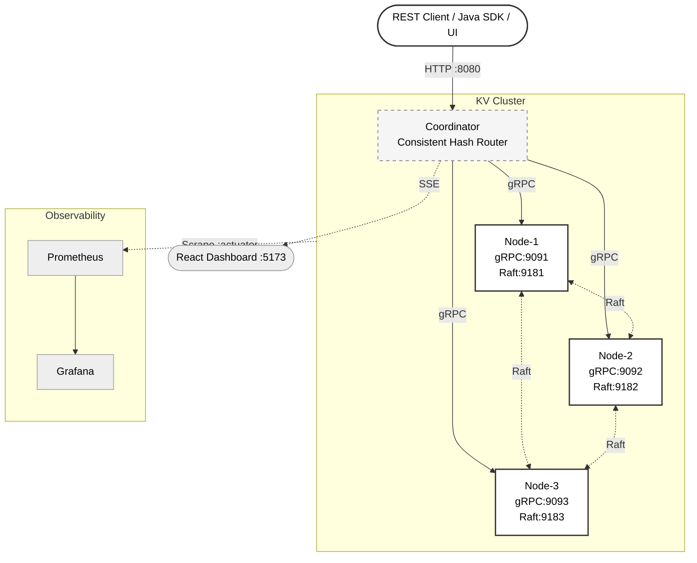
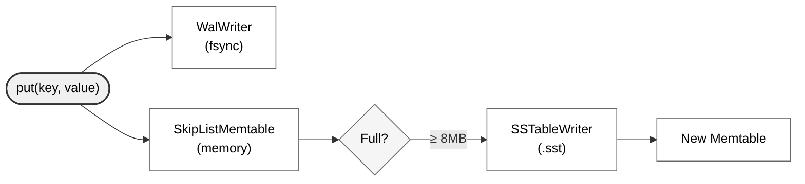
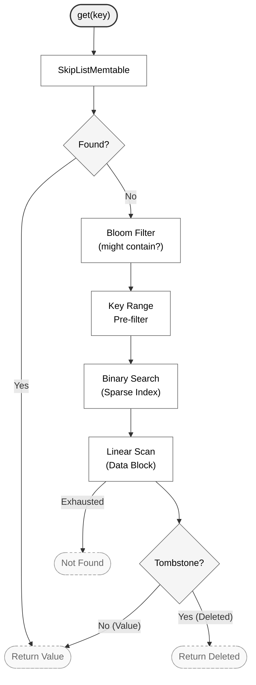
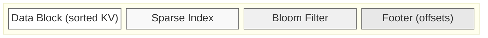
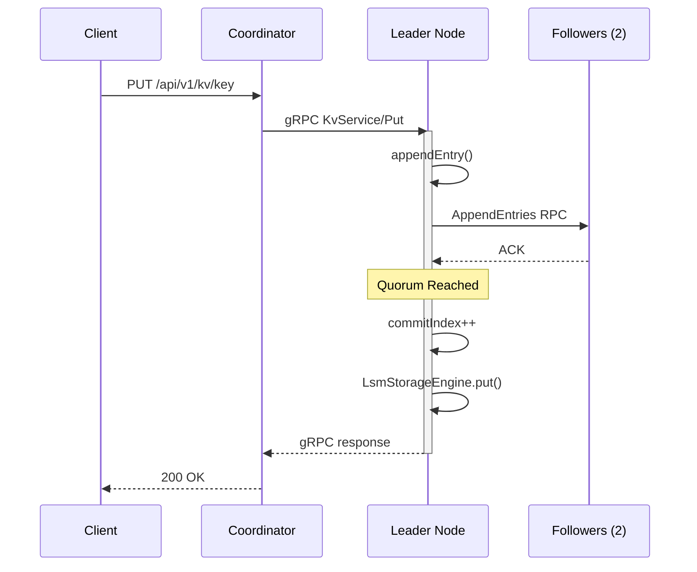
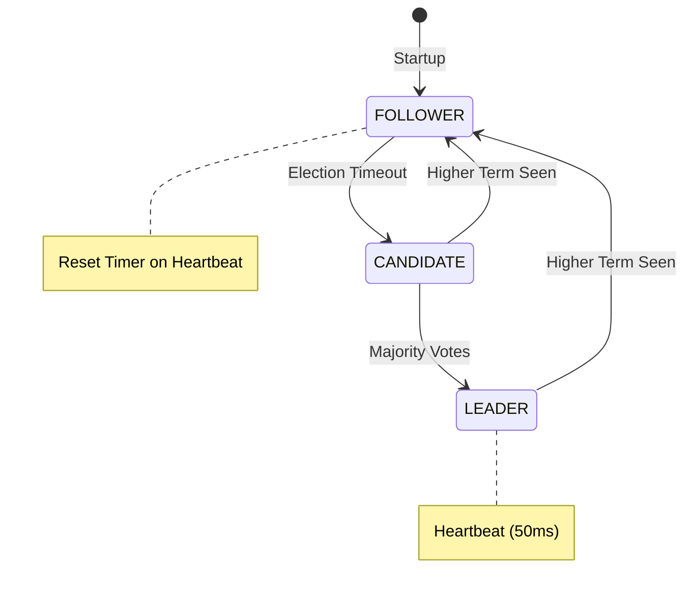

# Distributed NoSQL Key-Value Database

[](https://openjdk.org/projects/jdk/21/)
[](https://spring.io/projects/spring-boot)
[](https://grpc.io)
[](https://raft.github.io)
[](https://docs.docker.com/compose/)
[](LICENSE)

> A distributed key-value store built entirely from scratch in Java — modeled after the internals of **Redis**, **Cassandra**, **RocksDB**, and **DynamoDB**. Every subsystem is hand-rolled: the storage engine, the consistent-hash router, the Raft consensus state machine, and the observability pipeline.

---

## Table of Contents

- [Overview](#overview)
- [Architecture](#architecture)
- [Modules](#modules)
- [Storage Engine (LSM-Tree)](#storage-engine-lsm-tree)
- [Cluster & Routing](#cluster--routing)
- [Raft Consensus](#raft-consensus)
- [Observability Dashboard](#observability-dashboard)
- [Quick Start](#quick-start)
- [API Reference](#api-reference)
- [Configuration](#configuration)
- [Design Decisions](#design-decisions)
- [Project Structure](#project-structure)

---

## Overview

This project is a ground-up implementation of a distributed, sharded key-value database. The goal is to understand how production databases work at the systems level — not by using them, but by building each piece from first principles.

**What is implemented:**

| Layer | What | Inspired by |
|---|---|---|
| **Storage** | LSM-Tree with WAL, Memtable, SSTables, Compaction | RocksDB, Cassandra, LevelDB |
| **Read optimizations** | Bloom Filter (MurmurHash) + LRU Cache | RocksDB, BigTable |
| **Routing** | Consistent Hashing (MD5, 150 VNodes/node) | DynamoDB, Cassandra |
| **Transport** | gRPC + Protocol Buffers | Cassandra internal wire protocol |
| **Consensus** | Custom Raft state machine (leader election + log replication) | Etcd, CockroachDB |
| **Observability** | Prometheus metrics + Grafana + SSE dashboard | Datadog, CloudWatch |
| **Frontend** | React/Vite live dashboard with hash ring visualizer | — |

---

## Architecture



---

## Modules

| Module | Description |
|---|---|
| `proto/` | Protocol Buffer definitions (`.proto`) for all gRPC services: `KvService`, `RaftService` |
| `storage-engine/` | Self-contained LSM-tree library: WAL, Memtable, SSTables, Compaction, Bloom Filter, LRU Cache |
| `node/` | Runnable storage node: Spring Boot + gRPC server + Raft lifecycle + actuator metrics |
| `coordinator/` | REST gateway: consistent-hash routing, replication, SSE event stream |
| `raft/` | Transport-agnostic Raft consensus state machine + gRPC transport |
| `client/` | Java client SDK (in progress) |
| `ui/` | React/Vite real-time cluster dashboard |
| `config/` | Prometheus scrape config + Grafana provisioning |

---

## Storage Engine (LSM-Tree)

The storage engine is a complete Log-Structured Merge-Tree implementation, following the same fundamental design as RocksDB and Cassandra.

### Write Path



### Read Path



### SSTable File Format

Each `.sst` file is a single sequential write with four sections:



### Compaction

Size-tiered compaction runs in the background when the SSTable count exceeds the configured threshold. It merges N SSTables into one, eliminating tombstones and duplicate keys. This keeps read amplification bounded.

### TTL Support

Keys can be written with an optional TTL (time-to-live). A background `TtlReaper` thread periodically scans the memtable and removes expired entries before they reach disk.

---

## Cluster & Routing

### Consistent Hashing

The coordinator routes every key to the correct storage node using a **consistent-hash ring** — the same algorithm used by DynamoDB and Cassandra.

**Why not `hash(key) % N`?** Modulo hashing breaks when nodes join or leave — every key potentially remaps. Consistent hashing bounds remapping to only the keys owned by the affected node.

**How it works:**
1. The 128-bit MD5 hash space is treated as a ring (0 → 2¹²⁸ − 1).
2. Each physical node is placed at **150 virtual node positions** on the ring (e.g. `node-1#0`, `node-1#1`, …, `node-1#149`).
3. A key is hashed with MD5 and routed to the **first node clockwise** from its position.
4. The ring is backed by a `ConcurrentSkipListMap<BigInteger, NodeInfo>` — ceiling lookups are O(log N) and thread-safe.

**Virtual nodes** prevent hot-spots: with only 3 physical nodes and no VNodes, hash luck could give one node 60% of the keyspace. 150 VNodes ensure ≤5% deviation from perfectly even distribution.

### Replication

`ReplicationService` writes to the primary node via gRPC and fans out replicas to additional nodes. Quorum-based writes are in progress (Raft log replication replaces this).

---

## Raft Consensus

Each storage node runs a `RaftNode` — a complete implementation of the Raft consensus algorithm (Ongaro & Ousterhout, 2014). The implementation is transport-agnostic: the state machine only knows about `handleRequestVote` and `handleAppendEntries`, while `GrpcRaftTransport` handles the actual network communication.

### What is implemented

| Feature | Status |
|---|---|
| Leader election with randomized timeout (150–300ms) | ✅ |
| Heartbeat (empty AppendEntries every 50ms) | ✅ |
| RequestVote RPC — term + log-up-to-date check | ✅ |
| AppendEntries RPC — log consistency check + commit | ✅ |
| Log replication on majority quorum | ✅ |
| Raft → LSM bridge (committed entries applied to storage) | ✅ |
| gRPC transport (`GrpcRaftTransport`) | ✅ |
| Spring Boot lifecycle integration (`SmartLifecycle`) | ✅ |
| Persistent state (term + votedFor flushed to disk) | 🔄 In progress |

### Raft Write Flow



### Raft Role Visualization

The live dashboard shows each node's current Raft role in real-time:



- 👑 **LEADER** — amber border + crown badge in dashboard
- **FOLLOWER** — normal appearance
- **CANDIDATE** — purple badge (mid-election)

---

## Observability Dashboard

The React dashboard (`/ui`) connects to the coordinator's SSE stream (`GET /api/v1/monitor/events`) and updates in real-time without polling.

### Features

| Panel | Description |
|---|---|
| **Hash Ring** | SVG visualization of the MD5 ring with all 450 virtual node positions |
| **Node Cards** | Live memtable fill %, WAL size, SSTable count, LRU cache hit rate, Raft role |
| **Terminal Log** | Streaming event log (PUT/GET/DELETE operations, SSTable flushes, node status changes) |
| **Storage Visualizer** | Deep view of SSTable files and memtable contents per node |
| **Burst Test** | Fire N concurrent writes and observe how keys distribute across the ring |
| **Write Path** | Animated diagram of the WAL → Memtable → SSTable flow |
| **Interactive Store** | Manual PUT/GET/DELETE via the UI |

### Prometheus Metrics

Every node exports metrics via Micrometer at `/actuator/prometheus`. Prometheus scrapes all 4 services every 15s. Key metrics:

- `jvm_memory_used_bytes` — heap pressure
- `http_server_requests_seconds` — request latency histograms
- `grpc_server_requests_total` — gRPC call counts
- Custom: memtable fill %, WAL bytes, SSTable count (via `/api/v1/storage/state`)

---

## Quick Start

### Prerequisites

| Tool | Version | Install |
|---|---|---|
| Java JDK | 21+ | `brew install openjdk@21` |
| Docker Desktop | Latest | [docker.com](https://docker.com) |
| Node.js | 18+ | `brew install node` |
| grpcurl (optional) | Latest | `brew install grpcurl` |

### Option A — Full cluster with Docker Compose (recommended)

```bash
# Clone the repo
git clone https://github.com/shubhxtech/Distributed-NoSQL-Key-Value-Database.git
cd Distributed-NoSQL-Key-Value-Database

# Build images and start all 6 services
docker compose up --build -d

# Wait ~30s for health checks to pass, then verify
curl http://localhost:8080/api/v1/monitor/state
```

| Service | URL | Description |
|---|---|---|
| **Coordinator REST API** | http://localhost:8080 | PUT / GET / DELETE |
| **Dashboard UI** | http://localhost:5173 | Run separately (see below) |
| **Node-1 Actuator** | http://localhost:8081/actuator | Health + Prometheus metrics |
| **Node-2 Actuator** | http://localhost:8082/actuator | |
| **Node-3 Actuator** | http://localhost:8083/actuator | |
| **Prometheus** | http://localhost:9090 | Metric queries |
| **Grafana** | http://localhost:3000 | Dashboards (admin/admin) |

### Option B — Run locally without Docker

```bash
# Build all modules
./gradlew build -x test

# Terminal 1 — node-1
NODE_ID=node-1 GRPC_PORT=9091 HTTP_PORT=8081 RAFT_PORT=9181 \
  RAFT_PEERS="node-2=localhost:9182,node-3=localhost:9183" \
  ./gradlew :node:bootRun

# Terminal 2 — node-2
NODE_ID=node-2 GRPC_PORT=9092 HTTP_PORT=8082 RAFT_PORT=9182 \
  RAFT_PEERS="node-1=localhost:9181,node-3=localhost:9183" \
  ./gradlew :node:bootRun

# Terminal 3 — node-3
NODE_ID=node-3 GRPC_PORT=9093 HTTP_PORT=8083 RAFT_PORT=9183 \
  RAFT_PEERS="node-1=localhost:9181,node-2=localhost:9182" \
  ./gradlew :node:bootRun

# Terminal 4 — coordinator
./gradlew :coordinator:bootRun

# Terminal 5 — dashboard UI
cd ui && npm install && npm run dev
```

### Run tests

```bash
# Run all tests
./gradlew test

# Run Raft unit tests only (8 tests covering election, log replication, safety)
./gradlew :raft:test
```

---

## API Reference

### PUT — store a key-value pair

```bash
curl -X PUT http://localhost:8080/api/v1/kv/user:1 \
  -H 'Content-Type: application/json' \
  -d '{"value": "Shubh Sahu"}'

# Response
{"success": true, "routedTo": "node-2"}
```

### GET — retrieve a value

```bash
curl http://localhost:8080/api/v1/kv/user:1

# Found
{"found": true, "value": "Shubh Sahu", "routedTo": "node-2"}

# Not found
{"found": false, "routedTo": "node-2"}
```

### DELETE — remove a key

```bash
curl -X DELETE http://localhost:8080/api/v1/kv/user:1

# Response
{"success": true, "routedTo": "node-2"}
```

### Cluster monitoring

```bash
# Cluster state snapshot
curl http://localhost:8080/api/v1/monitor/state

# Consistent hash ring (450 virtual nodes)
curl http://localhost:8080/api/v1/monitor/ring

# SSE event stream (keep-alive, real-time)
curl -N http://localhost:8080/api/v1/monitor/events

# Storage state for a specific node
curl http://localhost:8081/api/v1/storage/state

# Deep storage dump (memtable + SSTable details)
curl http://localhost:8081/api/v1/storage/debug/dump

# Trigger manual compaction on node-1
curl -X POST http://localhost:8081/api/v1/storage/compact
```

### Fault injection (dashboard or API)

```bash
# Simulate a network partition (coordinator stops routing to node-2)
curl -X POST http://localhost:8080/api/v1/monitor/nodes/node-2/kill

# Heal the partition
curl -X POST http://localhost:8080/api/v1/monitor/nodes/node-2/restart
```

### Direct gRPC (via grpcurl)

```bash
# Ping a node
grpcurl -plaintext -d '{"sender_id":"cli"}' localhost:9091 kvstore.v1.KvService/Ping

# Put directly on node-1 (bypasses coordinator)
grpcurl -plaintext \
  -d '{"key":"hello","value":"'$(echo -n 'world' | base64)'"}' \
  localhost:9091 kvstore.v1.KvService/Put

# Get directly from node-1
grpcurl -plaintext \
  -d '{"key":"hello"}' \
  localhost:9091 kvstore.v1.KvService/Get
```

---

## Configuration

Node behavior is controlled via environment variables (used by Docker Compose) or `application.yml`.

| Variable | Default | Description |
|---|---|---|
| `NODE_ID` | `node-1` | Unique node identifier in the cluster |
| `HTTP_PORT` | `8080` | HTTP port for actuator + storage state API |
| `GRPC_PORT` | `9090` | gRPC port for KvService RPCs |
| `RAFT_PORT` | `9181` | Raft consensus gRPC port |
| `RAFT_PEERS` | _(empty)_ | Comma-separated peer list: `"node-2=host:9182,node-3=host:9183"` |
| `DATA_DIR` | `./data/node-1` | Directory for WAL files and SSTables |
| `MEMTABLE_MAX_MB` | `8` | Flush memtable to SSTable at this size |

Coordinator cluster membership is configured via `application.yml` or indexed environment variables:

```bash
KV_CLUSTER_NODES_0_ID=node-1
KV_CLUSTER_NODES_0_HOST=localhost
KV_CLUSTER_NODES_0_GRPC_PORT=9091
KV_CLUSTER_NODES_0_HTTP_PORT=8081
```

---

## Design Decisions

| Decision | Choice | Rationale |
|---|---|---|
| **Memtable structure** | `ConcurrentSkipListMap` | Sorted iteration needed for SSTable writes; lock-free concurrent reads; Java standard library |
| **SSTable format** | Custom binary (data + sparse index + bloom + footer) | Full control over on-disk layout; mirrors LevelDB/RocksDB format logic; no external dependency |
| **Compaction strategy** | Size-tiered | Simpler to implement; write-heavy workloads benefit from fewer, larger files |
| **Hash algorithm** | MD5 for consistent hashing | 128-bit output → lower collision probability than SHA-1's 160-bit on practical ring sizes; fast |
| **Virtual nodes** | 150 per physical node | Cassandra uses 256; 150 gives <5% load deviation for a 3-node cluster |
| **Consensus** | Custom Raft state machine | Maximum learning value; transport-agnostic design makes it unit-testable in isolation |
| **Raft transport** | gRPC on dedicated port | Separates consensus traffic from client traffic; allows independent tuning |
| **RaftNode integration** | `Consumer<RaftLogEntry>` callback | Decouples Raft from the storage engine; the applier lambda bridges the two |
| **Spring lifecycle** | `SmartLifecycle` | Ensures Raft starts after the gRPC server is ready and shuts down cleanly |
| **Metrics** | Micrometer + Prometheus | Standard JVM ecosystem; zero-code instrumentation for Spring + gRPC |
| **SSE for dashboard** | Server-Sent Events over WebSocket | One-directional event push; simpler than WebSocket; no library overhead |

### Consistency Model

- **Default:** Leader-based reads — all writes go through the Raft leader; strong consistency.
- **CAP stance:** CP — consistency is preferred over availability during network partitions. The cluster refuses writes if a quorum (2/3 nodes) cannot be reached.
- **Read staleness:** Follower reads are available as a future flag, trading consistency for lower read latency.

---

## Project Structure

```
Distributed-NoSQL-Key-Value-Database/
│
├── proto/                          # Protocol Buffer definitions
│   └── src/main/proto/
│       ├── kv.proto                # KvService: Put, Get, Delete, Ping RPCs
│       └── raft.proto              # RaftService: RequestVote, AppendEntries RPCs
│
├── storage-engine/                 # LSM-tree storage library (no Spring dep)
│   └── src/main/java/com/kvstore/engine/
│       ├── LsmStorageEngine.java   # Main engine: ties all subsystems together
│       ├── StorageEngine.java      # Interface: put / get / delete / close
│       ├── ValueEntry.java         # Value + timestamp + TTL + tombstone flag
│       ├── wal/                    # Write-Ahead Log
│       │   ├── WalWriter.java      # Append + fsync
│       │   ├── WalReader.java      # Replay on startup
│       │   └── WalEntry.java       # Serializable WAL record
│       ├── lsm/
│       │   └── SkipListMemtable.java  # ConcurrentSkipListMap wrapper
│       ├── sstable/
│       │   ├── SSTableWriter.java  # Writes data+index+bloom+footer
│       │   ├── SSTableReader.java  # Binary search + bloom pre-filter
│       │   └── SSTableMetadata.java# In-memory metadata per file
│       ├── bloomfilter/
│       │   └── BloomFilter.java    # MurmurHash bit-array filter
│       ├── cache/
│       │   └── LruCache.java       # LinkedHashMap-based LRU cache
│       ├── compaction/
│       │   └── CompactionManager.java  # Background size-tiered compaction
│       └── ttl/
│           └── TtlReaper.java      # Background TTL expiry thread
│
├── raft/                           # Raft consensus module (no Spring dep)
│   └── src/main/java/com/kvstore/raft/
│       ├── RaftNode.java           # Core state machine: election + replication
│       ├── RaftLog.java            # Thread-safe append-only log
│       ├── RaftLogEntry.java       # Log record: term + index + command bytes
│       ├── RaftCommand.java        # Serializable PUT/DELETE command (JSON)
│       ├── RaftRole.java           # Enum: FOLLOWER, CANDIDATE, LEADER
│       ├── RaftTransport.java      # Interface: sendRequestVote, sendAppendEntries
│       ├── GrpcRaftTransport.java  # gRPC implementation of RaftTransport
│       └── RaftServiceGrpcImpl.java# Server-side gRPC handler for peer RPCs
│
├── node/                           # Runnable storage node (Spring Boot)
│   └── src/main/java/com/kvstore/node/
│       ├── NodeApplication.java    # Spring beans: engine, raft, lifecycle
│       ├── config/
│       │   └── NodeProperties.java # @ConfigurationProperties binding
│       ├── grpc/
│       │   ├── KvServiceGrpcImpl.java  # Serves client PUT/GET/DELETE RPCs
│       │   └── RaftGrpcService.java    # @GrpcService wrapper for RaftServiceGrpcImpl
│       └── monitoring/
│           └── StorageStateController.java  # GET /api/v1/storage/state + compact
│
├── coordinator/                    # REST gateway + routing (Spring Boot)
│   └── src/main/java/com/kvstore/coordinator/
│       ├── CoordinatorApplication.java
│       ├── api/
│       │   └── KvRestController.java   # PUT / GET / DELETE REST endpoints
│       ├── routing/
│       │   └── ConsistentHashRouter.java  # MD5 ring + virtual nodes
│       ├── replication/
│       │   └── ReplicationService.java    # Fan-out writes to replica nodes
│       ├── client/
│       │   └── NodeGrpcClient.java        # gRPC stub pool per node
│       └── monitoring/
│           ├── ClusterEvent.java          # SSE event record (type + nodeId + extra)
│           ├── ClusterEventBus.java       # SSE emitter registry
│           ├── MonitoringController.java  # SSE stream + kill/restart endpoints
│           └── NodeStatePoller.java       # Polls nodes every 2s, emits events
│
├── ui/                             # React/Vite dashboard
│   └── src/
│       ├── components/
│       │   ├── Dashboard.tsx       # Main layout with tabs
│       │   ├── NodeCard.tsx        # Per-node metrics card (memtable, SSTs, Raft role)
│       │   ├── HashRing.tsx        # SVG consistent-hash ring visualizer
│       │   ├── TerminalLog.tsx     # Live event stream terminal
│       │   ├── StorageVisualizer.tsx  # SSTable + memtable deep view
│       │   ├── BurstTest.tsx       # Concurrent write load tester
│       │   ├── InteractiveStore.tsx   # Manual PUT/GET/DELETE UI
│       │   └── WritePath.tsx       # Animated write path diagram
│       └── hooks/
│           └── useClusterStream.ts # SSE connection + node state reducer
│
├── config/                         # Observability config
│   ├── prometheus.yml              # Scrape config for all 4 services
│   └── grafana/provisioning/       # Auto-provisioned Prometheus datasource
│
├── docker-compose.yml              # Full cluster: 3 nodes + coordinator + prometheus + grafana
├── Dockerfile.node                 # Multi-stage build: JDK21 builder → JRE21 runtime
├── Dockerfile.coordinator          # Multi-stage build for coordinator
├── build.gradle                    # Root Gradle build (plugin versions)
├── gradle.properties               # Shared dependency versions
└── settings.gradle                 # Subproject declarations
```

---

## License

MIT — see [LICENSE](LICENSE).

---

*Built to understand distributed systems from the ground up, not just use them.*
